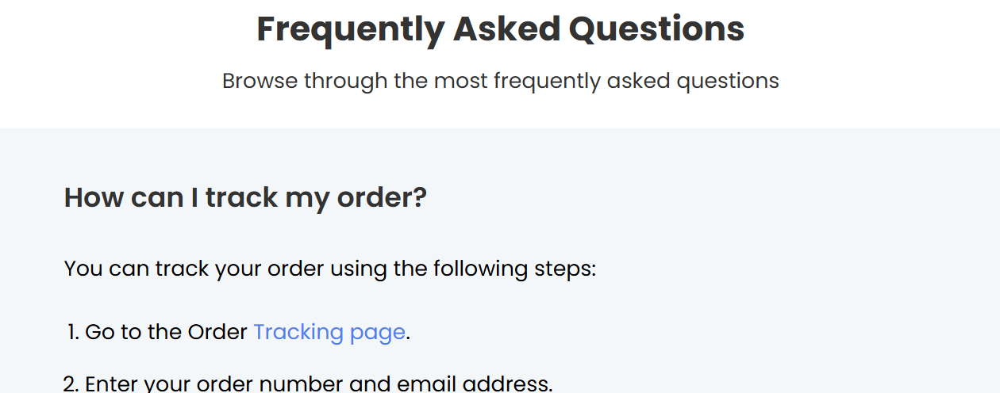
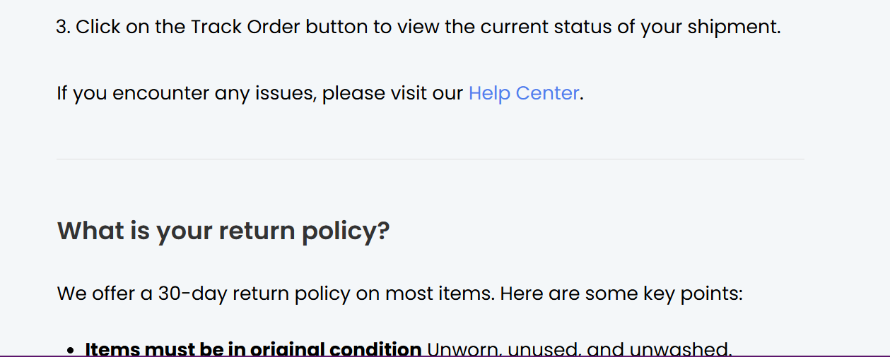
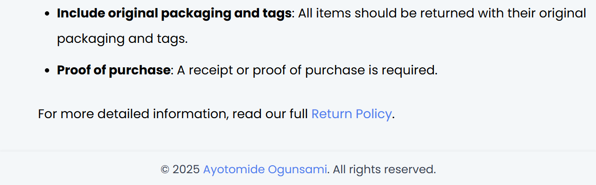

<!-- Please update value in the {}  -->

<h1 align="center">Frequently Asked Questions | devChallenges</h1>

   Solution for a challenge <a href="https://devchallenges.io/challenge/simple-faq-challenge" target="_blank">Simple FAQ</a> from <a href="http://devchallenges.io" target="_blank">devChallenges.io</a>.

  <h3>
    <a href="https://github.com/Ayotomi-de/simple-FAQ">
      Demo
    </a>
     | 
    <a href="https://ayotomi-de.github.io/simple-FAQ/">
      Solution
    </a>
     | 
    <a href="https://devchallenges.io/challenge/simple-faq-challenge">
      Challenge
    </a>
  </h3>

<!-- TABLE OF CONTENTS -->

## Table of Contents

- [Overview](#overview)
  - [What I learned](#what-i-learned)
  - [Useful resources](#useful-resources)
- [Built with](#built-with)
- [Features](#features)
- [Contact](#contact)
- [Acknowledgements](#acknowledgements)

<!-- OVERVIEW -->

## Overview

### What I learned
Developing this project was a thrilling journey. A start of something new and exciting expecially as it is the first challenge I've embarked on from <a href="http://devchallenges.io" target="_blank">devChallenges.io</a>.

I incorporated semantic HTML structure and explored responsive design techniques with CSS, including flexbox and custom properties. I also practiced structuring my project better and pushing commits consistently with Git.

### Useful resources
- [CHATGPT](https://chatgpt.com/) - This helped me understand git and it's concepts. I'll recommend it to anyone who wants to understand the basics of git.
- [Flexbox Froggy](https://flexboxfroggy.com) - Helped solidify my understanding of flexbox.

### Built with
- Semantic HTML5 markup
- CSS custom properties
- Flexbox

## Features
- Clean and responsive layout
- Beginner-friendly design

This application/site was created as a submission to a [DevChallenges](https://devchallenges.io/challenges-dashboard) challenge.

## Acknowledgements
<a href="http://devchallenges.io" target="_blank">DevChallenges.io</a> for providing the project idea. 
My good friend that introduced me to the site.

## Author
- Website: [Ayotomide's FAQ Website](https://ayotomi-de.github.io/simple-FAQ/)
- GitHub: [Ayotomi-de](https://github.com/Ayotomi-de/simple-FAQ)
